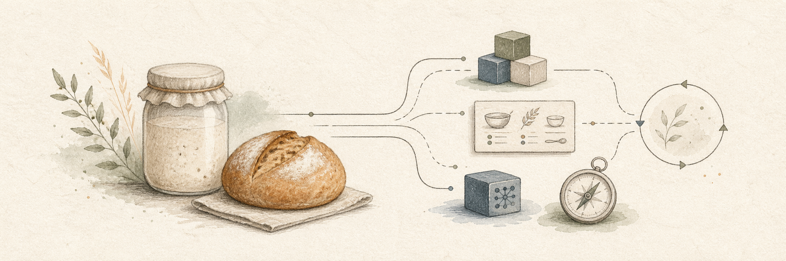

# onlinesourdough

> Same bake. Different deliveries.

onlinesourdough is a practical way to talk about software, business, and AI
working together.

AI can write code quickly. The work around the code is what helps it survive:
architecture people can understand, documentation, business context,
monitoring, security, handover, and technical ownership.

The aim is simple: software people can use responsibly, decisions a business
can stand behind, and codebases AI can safely help extend.

## Around the bake

- Plain-language ideas connecting IT, software, and business
- Practical resources, templates, and small technical playbooks
- Examples and project work around internal tools, automations, prototypes,
  and integrations

[Visit onlinesourdough.com](https://onlinesourdough.com)
